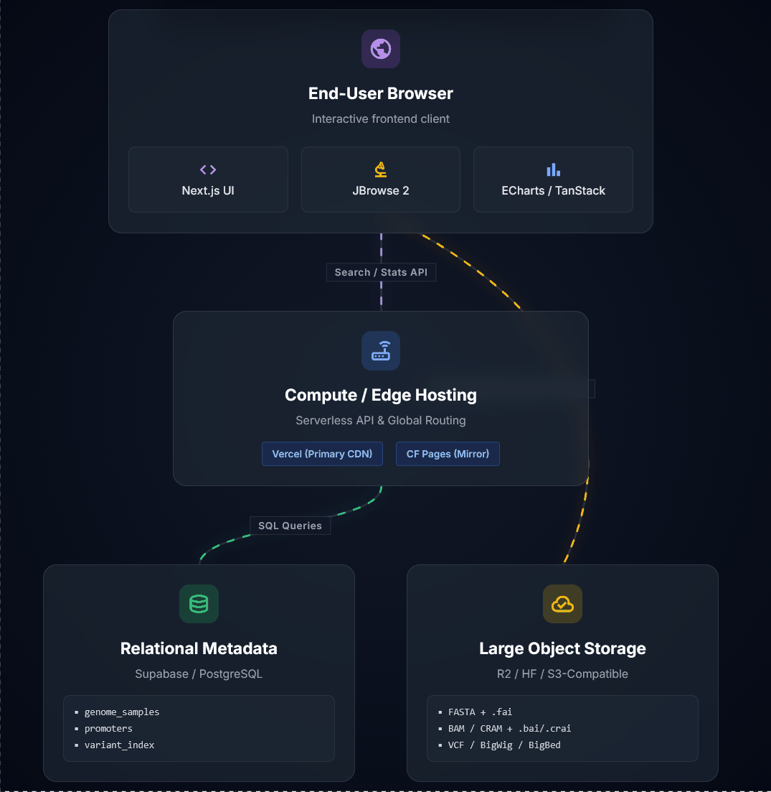
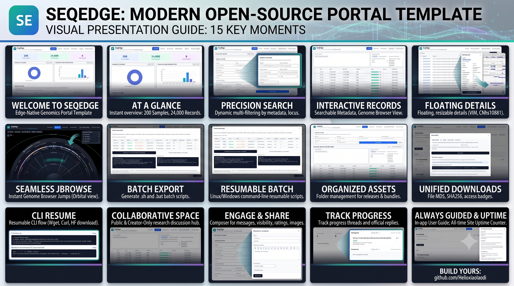

<a id="readme-top"></a>

# SeqEdge

Edge-Native Genomics Database Template

SeqEdge is an open-source template for coordinate-based genomics portals. It combines searchable metadata, embedded genome browser views, charts, discussion workflows, and storage-decoupled deployment for large biological files.

**Primary:** [https://seq-edge.vercel.app](https://seq-edge.vercel.app)  
**Mirror:** [https://seqedge.pages.dev](https://seqedge.pages.dev)  
**GitHub:** [https://github.com/Helloxiaolaodi/SeqEdge](https://github.com/Helloxiaolaodi/SeqEdge)

Language: **English** | [简体中文](./README.zh-CN.md) | [Issues](https://github.com/Helloxiaolaodi/SeqEdge/issues)

Detailed build guide: [SeqEdge Developer Notes](https://www.cnblogs.com/Administrator/p/21776736)

Stack: Next.js | React | Supabase | Cloudflare R2 | Hugging Face Datasets | Cloudflare Workers | JBrowse 2 | TanStack Table | ECharts


## Contents

1. [Overview](#overview)
2. [What SeqEdge Includes](#what-seqedge-includes)
3. [Collaboration and Attribution](#collaboration-and-attribution)
4. [Architecture and Deployment Model](#architecture-and-deployment-model)
5. [Quick Start](#quick-start)
6. [Data and Download Workflows](#data-and-download-workflows)
7. [Discussion and Administrator Operations](#discussion-and-administrator-operations)
8. [Maintenance Notes](#maintenance-notes)
9. [Tech Stack and References](#tech-stack-and-references)
10. [Known Limitation: Data Access Control](#known-limitation-data-access-control)
11. [License](#license)

## Overview

SeqEdge currently ships with four main product surfaces:

- **Overview**: summary cards, featured downloads, charts, and entry points.
- **Records**: searchable table plus embedded genome browser and record detail panel.
- **Discussion**: public or Administrator-only message threads with image upload, likes, bookmarks, and reply workflow.
- **Downloads**: site-wide file catalog with browser download and CLI download options.

The current default schema and UI are still genomics-oriented. Template users can generalize the project later, but the repository in its present state still uses promoter- and genome-related naming in the main data surfaces.

### Preview Media



*Architecture walkthrough used in the README. Media credit: generated with **Gemini 3.1 Pro**.*



*UI and primary-feature overview image for the README. Media credit: generated with **Gemini 3.1 Pro**.*

## What SeqEdge Includes

### End-user capabilities

- Search and filter promoter records by locus, gene, score, sample, species, tissue, cohort, and BMI class.
- Open the embedded genome browser and jump directly from a promoter record to the matching region.
- Inspect promoter details in a floating, resizable panel without hiding the browser.
- Download reference bundles, release archives, and sample-level files from one unified modal.
- View browser download, `wget`, `curl`, and `hf download` commands in the same file dialog.
- See file name, type, size, created and updated time, download count, access mode, MD5, and SHA256 together.
- Copy SHA256 with one click and use resume-capable CLI commands for large-file transfer.
- Generate `.sh` and `.bat` batch download scripts for public sample files.
- Submit public or Administrator-only discussions from the `Discussion` tab.
- Sign in with the allowed GitHub Administrator account to publish official replies.
- Upload images in discussion threads and open posted images in a zoomable lightbox.
- View likes and bookmarks in both the list and detail view.
- See a site uptime counter in the footer.

### Why this template is useful for fork users

- It separates metadata, UI, and large-file storage cleanly.
- It already includes a practical free-tier deployment pattern.
- It covers both research-data presentation and lightweight community interaction.
- It exposes enough configuration points for reuse without forcing a full rewrite on day one.

## Collaboration and Attribution

### Repository builders

This SeqEdge repository has been jointly built and iterated by the GitHub accounts **Helloxiaolaodi** and **yangsanduo**. Both accounts belong to the same project owner and are used as parallel maintainer identities for this repository and its surrounding deployment workflow.

### AI tools used during repository construction

SeqEdge has also been developed with support from the following AI tools during planning, implementation, documentation, and iteration work:

- **GLM 5.1**
- **GPT 5.4**
- **DeepSeek V4 Pro**

### README media attribution

- `docs/architecture.gif`: generated with **Gemini 3.1 Pro**.
- `docs/media/seqedge-ui-overview.png`: generated with **Gemini 3.1 Pro**.

## Architecture and Deployment Model

SeqEdge separates three layers:

- Metadata in Supabase / PostgreSQL
- Large genome files in object storage or Hugging Face Datasets
- App UI on Vercel or Cloudflare Pages

Recommended production layout:

1. Vercel for the primary site
2. Cloudflare Pages for the mirror site
3. Cloudflare Worker for Hugging Face proxying

### Current download strategy

SeqEdge uses a free-tier-friendly split workflow:

- Single-file downloads open one modal that shows browser download plus `wget -c`, `curl -L -C -`, and `hf download`.
- Large files are presented with resume-capable CLI commands, and `hf download` is the recommended option for large Hugging Face assets.
- JBrowse streaming uses the proxy and fallback chain for indexed browser reads.
- Bulk downloads generate `.sh` and `.bat` scripts for public files only.
- The modal shows download count, MD5, SHA256, access mode, hidden/password badges, and region hints.
- If a file is stored in a private Supabase bucket, SeqEdge can mint a signed URL through `/api/download-metadata/resolve`.

This keeps multi-GB transfers off the proxy path, preserves resumable CLI flows for end users, and allows genuinely private delivery when large files are moved from public storage to Supabase private storage.

## Quick Start

### 1. Install

```bash
git clone https://github.com/<your-account>/SeqEdge.git
cd SeqEdge
npm install
```

### 2. Configure environment variables

Copy `.env.example` to `.env.local` and replace placeholders.

Required database variables:

```bash
NEXT_PUBLIC_SUPABASE_URL=https://your-project.supabase.co
NEXT_PUBLIC_SUPABASE_ANON_KEY=your_anon_key_here
SUPABASE_SERVICE_ROLE_KEY=your_service_role_key_here
```

Required genome storage variables:

```bash
NEXT_PUBLIC_STORAGE_BASE_URL=https://huggingface.co/datasets/<user>/<repo>/resolve/main/<optional-subdir>
NEXT_PUBLIC_REFERENCE_ASSEMBLY=NC_045512.2
NEXT_PUBLIC_REFERENCE_DEFAULT_LOCUS=NC_045512.2:1-5000
NEXT_PUBLIC_REFERENCE_FASTA=scov2.fa
NEXT_PUBLIC_REFERENCE_FASTA_INDEX=scov2.fa.fai
NEXT_PUBLIC_REFERENCE_BED=scov2.genes.bed
NEXT_PUBLIC_REFERENCE_GFF3=scov2.genes.gff3
```

Optional but recommended:

```bash
NEXT_PUBLIC_HF_PROXY_URL=https://seqedge-hf-proxy.your-account.workers.dev
NEXT_PUBLIC_RELEASE_ARCHIVE_URL=https://huggingface.co/datasets/<user>/<repo>/resolve/main/releases/seqedge-release.tar.gz
NEXT_PUBLIC_RELEASE_ARCHIVE_SIZE=12.5 GB
NEXT_PUBLIC_RELEASE_ARCHIVE_MODE=cli
NEXT_PUBLIC_REFERENCE_BUNDLE_URL=https://huggingface.co/datasets/<user>/<repo>/resolve/main/reference/reference-bundle.zip
NEXT_PUBLIC_REFERENCE_BUNDLE_SIZE=180 MB
NEXT_PUBLIC_REFERENCE_BUNDLE_MODE=direct
```

Optional Administrator-reply and email variables:

```bash
GITHUB_ADMIN_USERNAME=your-github-login
NEXT_PUBLIC_GITHUB_ADMIN_USERNAME=your-github-login
FEEDBACK_EMAIL_API_URL=https://your-mail-service.example/send
FEEDBACK_EMAIL_API_KEY=your_mail_api_key
FEEDBACK_EMAIL_TO=owner@example.org
```

Important notes:

- `SUPABASE_SERVICE_ROLE_KEY` is required for Administrator-only write actions such as hiding or showing files in `Downloads`, saving `download_metadata`, issuing private signed URLs, and other privileged server-side mutations.
- Get it from Supabase Dashboard -> **Settings** -> **API** -> **Project API keys** -> `service_role`.
- Keep it server-side only. Never expose it through any `NEXT_PUBLIC_*` variable.
- Without a new deployment, the current build does not receive the new value.
- If files live in a subfolder, include that prefix in `NEXT_PUBLIC_STORAGE_BASE_URL`.
- Direct Hugging Face reads are supported, but the Worker is the most reliable JBrowse path.
- To enable Administrator replies, enable GitHub auth in Supabase and set both `GITHUB_ADMIN_USERNAME` and `NEXT_PUBLIC_GITHUB_ADMIN_USERNAME` to the same login.

### 3. Initialize the database

Run `schema.sql` in Supabase SQL Editor, then import your real metadata into at least:

- `genome_samples`
- `predicted_promoters`
- `variant_index`

For the current feature set, `schema.sql` also needs to create the interaction and download-control objects used by the live UI:

- `site_feedback`
- `feedback_comments`
- `site_reactions`
- `download_metadata`
- storage bucket and policies for `feedback-images`

Creating the schema alone will not populate the homepage statistics.

### 4. Run locally

```bash
npm run dev
```

### 5. Build for production

```bash
npm run build
npm run start
```

### 6. Deploy

Vercel:

- Build command: `npm run build`
- Output: Next.js default

Cloudflare Pages:

- Build command: `npm run build:cf`
- Preview command: `npm run preview:cf`
- Deploy command: `npm run deploy:cf`
- Output directory: `.open-next`

## Data and Download Workflows

### Where to configure downloads

- Featured download cards on the Overview tab: `src/site-config.ts`
- Sample-level download metadata: `genome_samples.vcf_download_url`, `genome_samples.fasta_download_url`, `genome_samples.gb_download_url`, `genome_samples.bed_download_url`, `genome_samples.gff3_download_url`, and related `*_download_mode` fields
- Unified download metadata model and CLI generation: `src/lib/download-info.ts`
- Single-file modal behavior and Administrator edit controls: `src/components/download-actions.tsx`
- Batch script generation for public entries: `src/components/promoter-table.tsx` and `/api/samples/batch`
- Dedicated site-wide download catalog with hierarchical folder browsing: `src/components/download-catalog-panel.tsx` and `/api/download-catalog`
- Private signed-URL resolution: `/api/download-metadata/resolve` backed by the `download_metadata` table

### What the download modal now exposes

For public files with a stable raw URL, the `Download options` modal now exposes four practical delivery paths in the same dialog:

- Browser download
- Copyable public direct URL for tools such as `Free Download Manager`, `Motrix`, and `IDM`
- `Global (Official)` resumable commands on `huggingface.co`
- `Asia-Pacific (Mirror)` resumable commands on `hf-mirror.com`

For the example file `817-food-biochem-materials.zip`, that means the modal can show both the official route and the Asia-friendly mirror route without changing the dataset path itself.

Official route:

```bash
wget -c -O "817-food-biochem-materials.zip" "https://huggingface.co/datasets/Helloxiaolaodi/seqedge-data/resolve/main/817-food-biochem/817-food-biochem-materials.zip?download=true"
curl -L -C - -o "817-food-biochem-materials.zip" "https://huggingface.co/datasets/Helloxiaolaodi/seqedge-data/resolve/main/817-food-biochem/817-food-biochem-materials.zip?download=true"
hf download Helloxiaolaodi/seqedge-data 817-food-biochem/817-food-biochem-materials.zip --repo-type dataset --local-dir .
```

Asia-Pacific mirror route:

```bash
wget -c -O "817-food-biochem-materials.zip" "https://hf-mirror.com/datasets/Helloxiaolaodi/seqedge-data/resolve/main/817-food-biochem/817-food-biochem-materials.zip?download=true"
curl -L -C - -o "817-food-biochem-materials.zip" "https://hf-mirror.com/datasets/Helloxiaolaodi/seqedge-data/resolve/main/817-food-biochem/817-food-biochem-materials.zip?download=true"
HF_ENDPOINT=https://hf-mirror.com hf download Helloxiaolaodi/seqedge-data 817-food-biochem/817-food-biochem-materials.zip --repo-type dataset --local-dir .
```

This keeps the UI aligned with real network conditions instead of documenting only one nominal path.

### Add a Hugging Face file to SeqEdge

The current codebase supports three practical Hugging Face integration points:

1. A homepage featured download card
2. A sample-level download entry shown inside the record detail panel and detail page
3. The dedicated `Downloads` tab, which lets users browse downloadable files by folder level in the path hierarchy and opens the same unified download modal

#### 1. Use the correct direct file URL

Do not paste the Hugging Face page URL that contains `/blob/main/`.

- Page URL example: `https://huggingface.co/datasets/Helloxiaolaodi/seqedge-data/blob/main/817-food-biochem/817-food-biochem-materials.zip`
- Direct file URL example: `https://huggingface.co/datasets/Helloxiaolaodi/seqedge-data/resolve/main/817-food-biochem/817-food-biochem-materials.zip`

SeqEdge now normalizes common Hugging Face `blob` links to `resolve` links, but you should still store the direct file URL in your database and environment variables.

#### 2. Show the file on the homepage

Set the featured archive environment variables:

```bash
NEXT_PUBLIC_RELEASE_ARCHIVE_LABEL=Download 817 Food Biochem Materials
NEXT_PUBLIC_RELEASE_ARCHIVE_DESCRIPTION=Public Hugging Face dataset package for large-file download, browser delivery, and resume-capable CLI retrieval.
NEXT_PUBLIC_RELEASE_ARCHIVE_URL=https://huggingface.co/datasets/Helloxiaolaodi/seqedge-data/resolve/main/817-food-biochem/817-food-biochem-materials.zip
NEXT_PUBLIC_RELEASE_ARCHIVE_SIZE=~700 MB
NEXT_PUBLIC_RELEASE_ARCHIVE_MODE=cli
```

This powers the featured card on the Overview tab and opens the unified download modal. The same file can also appear in the dedicated `Downloads` tab when it is present in the site-wide catalog, where visitors browse folders level by level from the dataset root.

#### 3. Show the same file as a sample-level download entry

The current UI renders these sample-level file slots in both the floating detail panel and the standalone detail page:

- `vcf_download_url`
- `fasta_download_url`
- `gb_download_url`
- `bed_download_url`
- `gff3_download_url`

For a generic package from Hugging Face, the least disruptive option in the current schema is to use `gb_download_url` as a generic package slot. The UI labels this slot as `Download Package`.

Example SQL:

```sql
update genome_samples
set gb_download_url = 'https://huggingface.co/datasets/Helloxiaolaodi/seqedge-data/resolve/main/817-food-biochem/817-food-biochem-materials.zip'
where sample_id = 'CNhs10881';
```

You can also attach the same file to the dedicated `Downloads` tab through `download_metadata`, so the site exposes one consistent single-file modal whether the visitor enters from Overview, Records, or Downloads.

#### 4. Add hidden, password, and private-delivery metadata

If the file is public on Hugging Face, you can still attach site-level metadata and UI controls through `download_metadata`, for example custom label, description, hashes, hidden flag, and password prompt.

```sql
insert into download_metadata (
  download_key,
  custom_label,
  custom_description,
  custom_file_type,
  custom_size_bytes,
  storage_provider,
  hidden,
  md5_checksum,
  sha256_checksum
)
values (
  'https://huggingface.co/datasets/Helloxiaolaodi/seqedge-data/resolve/main/817-food-biochem/817-food-biochem-materials.zip',
  '817 Food Biochem Materials',
  'Public Hugging Face dataset package exposed through the SeqEdge unified download modal.',
  'Archive (zip)',
  734003200,
  'public_url',
  false,
  null,
  null
)
on conflict (download_key) do update set
  custom_label = excluded.custom_label,
  custom_description = excluded.custom_description,
  custom_file_type = excluded.custom_file_type,
  custom_size_bytes = excluded.custom_size_bytes,
  storage_provider = excluded.storage_provider,
  hidden = excluded.hidden,
  md5_checksum = excluded.md5_checksum,
  sha256_checksum = excluded.sha256_checksum;
```

Important: for a public Hugging Face `resolve` URL, hidden/password remain only site-level UI controls. They do not stop direct anonymous download if someone already knows the public URL.

#### 5. When you need real private downloads

For actual gated delivery, store the file in a private Supabase bucket and set the matching `download_metadata.storage_provider` to `supabase_private`. SeqEdge then resolves the file through `/api/download-metadata/resolve` and returns a short-lived signed URL.

That is the only fully implemented private-download path in the current codebase.

### Uploading data to Hugging Face

SeqEdge hosts large data files such as release archives, reference bundles, and sample-level files on a Hugging Face dataset repository, by default `https://huggingface.co/datasets/Helloxiaolaodi/seqedge-data`.

#### 1. Install the CLI

The `hf` command is bundled with `huggingface_hub`.

```bash
pip install -q "huggingface_hub"
```

On Windows the executable may land in the per-user `Scripts` folder. Either add that folder to PATH or call it by full path.

#### 2. Log in

```bash
hf auth login
# or set it as an environment variable:
export HF_TOKEN=hf_xxxxxxxxxxxx   # Linux/macOS
$env:HF_TOKEN = "hf_xxxxxxxxxxxx" # Windows PowerShell
```

Verify with `hf auth whoami`.

#### 3. Upload a file or folder

```bash
hf upload <namespace/dataset-name> <local-path> <path-in-repo> --repo-type dataset
```

Example:

```bash
hf upload Helloxiaolaodi/seqedge-data "E:\data\817-food-biochem-materials.zip" "817-food-biochem/817-food-biochem-materials.zip" --repo-type dataset
```

#### 4. Resumable transfer

Both `hf upload` and `hf download` reuse already transmitted staging data. If a run times out or a network error appears, simply run the same command again and it continues.

#### 5. Acceleration and the Xet engine

```bash
export HF_XET_HIGH_PERFORMANCE=1    # Linux/macOS
$env:HF_XET_HIGH_PERFORMANCE = "1"  # Windows PowerShell
```

If your proxy cannot complete the TLS handshake to `*.xethub.hf.co`, fall back to the compatible HTTP channel:

```bash
export HF_HUB_DISABLE_XET=1         # Linux/macOS
$env:HF_HUB_DISABLE_XET = "1"       # Windows PowerShell
```

#### 6. Network and proxy tips

Hugging Face stores long-term data in AWS S3 in the US-East region. From Asia, a United States proxy node usually performs much better than a local or nearby node.

```bash
export HTTP_PROXY=http://127.0.0.1:7897 HTTPS_PROXY=http://127.0.0.1:7897   # Linux/macOS
$env:HTTP_PROXY="http://127.0.0.1:7897"; $env:HTTPS_PROXY="http://127.0.0.1:7897" # Windows PowerShell
```

Confirm the proxy is actually taking effect before uploading:

```bash
curl -I https://huggingface.co
```

#### 7. Downloading large files for users

For multi-hundred-MB to GB files prefer the HF CLI:

```bash
pip install -q "huggingface_hub"
hf download Helloxiaolaodi/seqedge-data 817-food-biochem/817-food-biochem-materials.zip --repo-type dataset --local-dir .
```

Classic commands also resume:

```bash
wget -c -O <name> "<resolve url>"
curl -L -C - -o <name> "<resolve url>"
```

For users in China and some Asia-Pacific networks, the mirror route may be materially more reliable than the official domain. SeqEdge therefore exposes both command sets in the modal instead of forcing users to discover the mirror path elsewhere.

### Genome browser notes

For best JBrowse performance, configure a Cloudflare Worker proxy. SeqEdge probes in order:

1. External `NEXT_PUBLIC_HF_PROXY_URL`
2. Built-in `/api/hf-proxy/<file>` route
3. Direct Hugging Face reads

If the browser still shows `Reference data unreachable`, usually one of these is wrong:

- `NEXT_PUBLIC_STORAGE_BASE_URL`
- `NEXT_PUBLIC_REFERENCE_FASTA_INDEX`
- Hugging Face dataset subdirectory
- Worker deployment or `HF_REPO_BASE`

SeqEdge also opens the first reachable annotation track automatically so the viewer does not land in `No tracks active` when real tracks are available.

## Discussion and Administrator Operations

### Discussion module

SeqEdge includes a lightweight interaction area for research communication:

- Click the `Discussion` tab to browse discussions and open the floating composer.
- Messages support a title, name or nickname, email, optional affiliation, category, rating, and visibility.
- Messages can be `Public` or `Administrator only`.
- The `Discussion` tab shows discussions split into `In progress` and `Completed`.
- Discussions can be sorted, including a `Most liked` view.
- Every posted discussion thread and every follow-up comment is rendered back on the site inside the same thread view.
- Administrator replies appear on the site and are shown inline in the thread once saved.
- Follow-up comments from visitors remain visible under the thread and are loaded from `feedback_comments`.
- New top-level threads send an Administrator notification email whether the thread is `Public` or `Administrator only`.
- New follow-up comments in an existing thread also send an Administrator notification email.
- The reply action is restricted to the GitHub account matching `GITHUB_ADMIN_USERNAME`, while the Administrator UI in the browser also expects `NEXT_PUBLIC_GITHUB_ADMIN_USERNAME` to match the same login.
- Posted and replied timestamps are displayed for each thread.
- Visitors can leave `Like` and `Bookmark` reactions.
- Image uploads show success or failure feedback during submission.

Required database objects for this feature are included in `schema.sql`. Required environment variables are listed in `.env.example`.

### Administrator reply setup

To let the site owner sign in and reply from the browser:

#### 1. Enable GitHub Auth in Supabase

In Supabase Dashboard, go to **Authentication** -> **Sign In / Providers**. Find **GitHub** in the provider list and enable **Sign in with GitHub**.

#### 2. Configure Supabase Auth URLs

1. In Supabase Dashboard, go to **Authentication** -> **URL Configuration**.
2. Set **Site URL** to your production domain, for example `https://seq-edge.vercel.app`.
3. Under **Redirect URLs**, add all deployed domains:
   - `https://seq-edge.vercel.app`
   - `https://seq-edge.vercel.app/**`
   - `https://seqedge.pages.dev`
   - `https://seqedge.pages.dev/**`
4. Save.

If the Site URL is left as `http://localhost:3000`, OAuth sign-in will redirect users there in production.

#### 3. Get GitHub OAuth credentials

1. Go to GitHub -> **Settings** -> **Developer settings** -> **OAuth Apps** -> **New OAuth App**.
2. Set an application name such as `SeqEdge Auth`.
3. Set **Homepage URL** to your production URL or local dev URL.
4. Set **Authorization callback URL** to `https://<your-project>.supabase.co/auth/v1/callback`.
5. Register the application and generate a client secret.
6. Copy the **Client ID** and **Client Secret** into Supabase and save.

#### 4. Configure environment

Set both `GITHUB_ADMIN_USERNAME` and `NEXT_PUBLIC_GITHUB_ADMIN_USERNAME` in `.env.local` or your deployment dashboard to the same GitHub login that may reply.

### Email notification setup (Resend)

SeqEdge uses [Resend](https://resend.com) to deliver feedback notification emails to the site Administrator.

When configured, the current implementation sends:

- an Administrator notification email for each new top-level discussion thread;
- that top-level thread notification also covers `Administrator only` threads, not only public threads;
- an Administrator notification email for each new follow-up comment in a discussion thread;
- a visitor reply email when the Administrator posts an official reply and the visitor supplied an email address.

#### Test mode

1. Sign up at [resend.com](https://resend.com) and open **API Keys**.
2. Create a new API key.
3. Use the test sender address `onboarding@resend.dev`.
4. In test mode, emails are only delivered to your own verified email address.

#### Environment variables

```bash
FEEDBACK_EMAIL_API_URL=https://api.resend.com/emails
FEEDBACK_EMAIL_API_KEY=re_xxxxxxxxxxxx
FEEDBACK_EMAIL_TO=owner@example.org
```

#### Moving to production

To send reply emails to any visitor, you need a verified custom domain in Resend. If you deploy only on `pages.dev` or `vercel.app`, you do not control those DNS zones, so you still need your own registered domain for production email sending.

## Maintenance Notes

### Repository structure that fork users usually care about

- `src/`: main application code
- `public/`: static assets
- `docs/`: README media and project notes
- `schema.sql`: database schema and related SQL objects
- `cloudflare-templates/hf-proxy/`: Cloudflare Worker proxy template
- `scripts/`: project utility scripts

### Minimal files to keep

Keep these for the current feature set:

- `src/`
- `schema.sql`
- `README.md`
- `README.zh-CN.md`
- `cloudflare-templates/hf-proxy/`
- `scripts/`

Default template SVG assets under `public/` that are not used by your deployment can be removed.

### Site uptime

The footer shows a live uptime counter:

`This site has been running: X d X h X m X s`

Set the start timestamp in `src/site-config.ts` under `uptime.startAt`.

### Validation

Recommended checks before push:

```bash
npm run lint
npm run build
```

If both pass with your real environment values, the repo is ready for deployment testing.

## Tech Stack and References

SeqEdge builds on an open-source stack for UI rendering, data access, browser-based reference viewing, and deployment.

| Tool | Version | Function | Reference |
| --- | --- | --- | --- |
| [Next.js](https://nextjs.org/docs) | `15.5.21` | App framework and runtime | Official documentation |
| [React](https://react.dev/learn) | `19.2.4` | Component rendering and client UI state | Official learning docs |
| [`@supabase/supabase-js`](https://supabase.com/docs/reference/javascript/introduction) | `^2.110.7` | Database, auth, and storage client access | Supabase JavaScript client docs |
| [`@jbrowse/product-core`](https://jbrowse.org/jb2/docs/) | `^4.3.0` | Embedded reference browser core | JBrowse 2 docs |
| [`@jbrowse/react-linear-genome-view`](https://www.npmjs.com/package/@jbrowse/react-linear-genome-view) | `^3.1.0` | React wrapper for the linear browser view | npm package page |
| [`@tanstack/react-table`](https://tanstack.com/table/latest/docs/guide/introduction) | `^8.21.3` | Record table rendering and interactions | Official docs |
| [ECharts](https://echarts.apache.org/handbook/en/get-started/) | `^6.1.0` | Summary charts and dashboard visuals | Official handbook |
| [`@opennextjs/cloudflare`](https://opennext.js.org/cloudflare) | `^1.20.2` | Cloudflare build adapter | OpenNext Cloudflare docs |
| [Wrangler](https://developers.cloudflare.com/workers/wrangler/) | `^4.113.0` | Cloudflare deployment CLI | Cloudflare Workers CLI docs |

Additional community link:

- [LINUX DO](https://linux.do/) - A next-generation Linux community

## Known Limitation: Data Access Control

Per-file **Hide** and **Download password** controls are only genuine access control when the file is delivered through the signed-URL path. In the current codebase, that real protected flow is implemented for entries whose `download_metadata.storage_provider` is `supabase_private`: the site verifies optional passwords and then mints a short-lived Supabase signed URL.

If the underlying file still lives on a publicly readable Hugging Face dataset repository, hide/password remain an in-page convenience only. Anyone who knows a `https://huggingface.co/datasets/<user>/<repo>/resolve/main/<path>` URL can fetch it directly with `wget`, `curl`, or `hf download`, bypassing the site entirely.

If you need real access control, choose one of:

- Keep large files in a private Supabase Storage bucket and serve signed, time-limited URLs generated by an authenticated API route.
- Set the Hugging Face dataset repository to private and accept that public website downloads stop working until you add your own gated proxy layer.
- Move sensitive files to a provider with built-in gating.

In short: public HF URL plus hide/password only discourages casual on-site download; private signed storage prevents direct anonymous download.

## License

This project is licensed under the [MIT License](LICENSE).

[Back to top](#readme-top)
