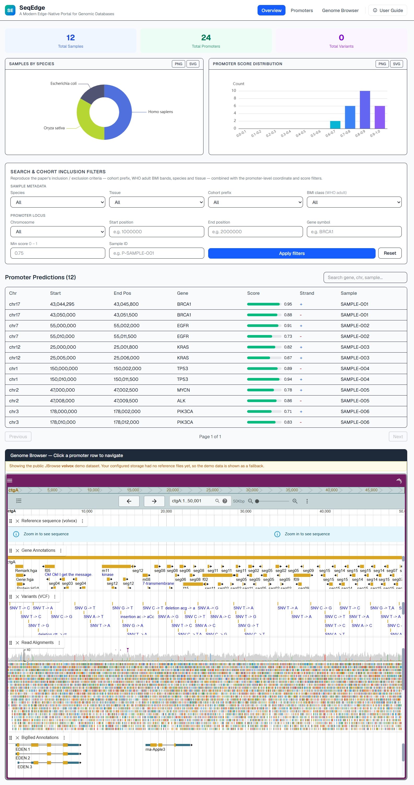

# SeqEdge



SeqEdge is a lightweight template for building a public genomics site with searchable metadata, an embedded JBrowse view, and direct dataset downloads.

Primary: [https://seq-edge.vercel.app](https://seq-edge.vercel.app)
Mirror: [https://seqedge.pages.dev](https://seqedge.pages.dev)

Chinese README: [README.zh-CN.md](./README.zh-CN.md)

## What Users Can Do

- Search and filter promoter records by locus, gene, score, sample, species, tissue, cohort, and BMI class.
- Open the embedded genome browser and jump directly from a promoter record to the matching region.
- Inspect promoter details in a floating, resizable panel without hiding the browser.
- Download reference bundles, release archives, and sample-level files from public storage.
- Submit public or creator-only messages via the `Discussion` tab, then review thread status on the same page.
- Sign in with the allowed GitHub creator account to publish official replies.
- Check the site uptime counter at the bottom of the page.

## Current Download Strategy

SeqEdge uses a free-tier friendly split workflow:

- Small files: show `Download`
- Large files: show `Download`, `Copy wget`, and `Copy curl`
- JBrowse streaming: use the proxy/fallback chain for indexed browser reads
- Bulk downloads: go directly to the public file host with `?download=true`

This keeps multi-GB transfers off the proxy path and is the recommended setup when large files live on Hugging Face Datasets.

## Deployment Model

SeqEdge separates three parts:

- Metadata in Supabase / PostgreSQL
- Large genome files in object storage or Hugging Face Datasets
- App UI on Vercel or Cloudflare Pages

Recommended production layout:

1. Vercel for the primary site
2. Cloudflare Pages for the mirror site
3. Cloudflare Worker for Hugging Face proxying

The main interface has three tabs: **Overview**, **Promoters** (promoter table + genome browser), and **Discussion**.

## Quick Start

### 1. Install

```bash
git clone https://github.com/<your-account>/SeqEdge.git
cd SeqEdge
npm install
```

### 2. Configure environment variables

Copy `.env.example` to `.env.local` and replace placeholders.

Required database variables:

```bash
NEXT_PUBLIC_SUPABASE_URL=https://your-project.supabase.co
NEXT_PUBLIC_SUPABASE_ANON_KEY=your_anon_key_here
SUPABASE_SERVICE_ROLE_KEY=your_service_role_key_here
```

Required genome storage variables:

```bash
NEXT_PUBLIC_STORAGE_BASE_URL=https://huggingface.co/datasets/<user>/<repo>/resolve/main/<optional-subdir>
NEXT_PUBLIC_REFERENCE_ASSEMBLY=NC_045512.2
NEXT_PUBLIC_REFERENCE_DEFAULT_LOCUS=NC_045512.2:1-5000
NEXT_PUBLIC_REFERENCE_FASTA=scov2.fa
NEXT_PUBLIC_REFERENCE_FASTA_INDEX=scov2.fa.fai
NEXT_PUBLIC_REFERENCE_BED=scov2.genes.bed
NEXT_PUBLIC_REFERENCE_GFF3=scov2.genes.gff3
```

Optional but recommended:

```bash
NEXT_PUBLIC_HF_PROXY_URL=https://seqedge-hf-proxy.your-account.workers.dev
NEXT_PUBLIC_RELEASE_ARCHIVE_URL=https://huggingface.co/datasets/<user>/<repo>/resolve/main/releases/seqedge-release.tar.gz
NEXT_PUBLIC_RELEASE_ARCHIVE_SIZE=12.5 GB
NEXT_PUBLIC_RELEASE_ARCHIVE_MODE=cli
NEXT_PUBLIC_REFERENCE_BUNDLE_URL=https://huggingface.co/datasets/<user>/<repo>/resolve/main/reference/reference-bundle.zip
NEXT_PUBLIC_REFERENCE_BUNDLE_SIZE=180 MB
NEXT_PUBLIC_REFERENCE_BUNDLE_MODE=direct
```

Optional creator-reply and email variables:

```bash
GITHUB_ADMIN_USERNAME=your-github-login
FEEDBACK_EMAIL_API_URL=https://your-mail-service.example/send
FEEDBACK_EMAIL_API_KEY=your_mail_api_key
FEEDBACK_EMAIL_TO=owner@example.org
```

Notes:

- `SUPABASE_SERVICE_ROLE_KEY` is recommended for production API routes.
- If files live in a subfolder, include that prefix in `NEXT_PUBLIC_STORAGE_BASE_URL`.
- Direct Hugging Face reads are supported, but the Worker is the most reliable JBrowse path.
- To enable creator replies: enable GitHub auth provider in Supabase (see [Creator Reply Setup](#creator-reply-setup)) and set `GITHUB_ADMIN_USERNAME` to the single GitHub login allowed to reply.

### 3. Initialize the database

Run `schema.sql` in Supabase SQL Editor, then import your real metadata into at least:

- `genome_samples`
- `predicted_promoters`
- `variant_index`

Creating the schema alone will not populate the homepage statistics.

### 4. Run locally

```bash
npm run dev
```

### 5. Build for production

```bash
npm run build
npm run start
```

### 6. Deploy

Vercel:

- Build command: `npm run build`
- Output: Next.js default

Cloudflare Pages:

- Build command: `npm run build:cf`
- Preview command: `npm run preview:cf`
- Deploy command: `npm run deploy:cf`
- Output directory: `.open-next`

## Genome Browser Notes

For best JBrowse performance, configure a Cloudflare Worker proxy. SeqEdge probes in order:

1. External `NEXT_PUBLIC_HF_PROXY_URL`
2. Built-in `/api/hf-proxy/<file>` route
3. Direct Hugging Face reads

If the browser still shows `Reference data unreachable`, usually one of these is wrong:

- `NEXT_PUBLIC_STORAGE_BASE_URL`
- `NEXT_PUBLIC_REFERENCE_FASTA_INDEX`
- Hugging Face dataset subdirectory
- Worker deployment or `HF_REPO_BASE`

SeqEdge also opens the first reachable annotation track automatically so the viewer does not land in `No tracks active` when real tracks are available.

## Where To Configure Downloads

- Overview download cards: `src/site-config.ts`
- Sample-level download metadata: `genome_samples.vcf_download_url`, `genome_samples.fasta_download_url`
- Large-file CLI actions: set `vcf_download_mode` or `fasta_download_mode` to `cli`

## User Guide Content

The in-app User Guide covers four sections:

1. Browsing Data
2. Downloading Data
3. Discussion
4. For Site Creators

This is where end users can learn the difference between browser downloads and CLI downloads for large files, and how to use the built-in feedback channel.

## Discussion

SeqEdge includes a lightweight interaction area for research communication:

- Click the `Discussion` tab to browse threads and open the floating composer. Anyone can sign in with GitHub to post.
- Messages support a title, name or nickname, email, optional affiliation, category, rating, and visibility.
- Messages can be `Public` or `Creator only` (private).
- The `Discussion` tab shows threads split into `In progress` and `Completed`.
- Creator replies appear on the site and can also be emailed when the email API is configured.
- The reply action is restricted to the GitHub account matching `GITHUB_ADMIN_USERNAME`.
- Posted and replied timestamps are displayed for each thread.
- Visitors can also leave `Like` and `Bookmark` reactions.

Required database objects for this feature are included in `schema.sql`.
Required environment variables are listed in `.env.example`.

## Creator Reply Setup

To let the site owner sign in and reply from the browser:

### 1. Enable GitHub Auth in Supabase

In Supabase Dashboard, go to **Authentication** → **Sign In / Providers** (under CONFIGURATION, not OAuth Server). Find **GitHub** in the provider list, expand it, and enable **Sign in with GitHub**.

### 2. Configure Supabase Auth URLs (critical for production)

After enabling GitHub Auth, update the URL configuration so OAuth redirects land on your production site instead of localhost:

1. In Supabase Dashboard, go to **Authentication** → **URL Configuration**
2. Set **Site URL** to your production domain, e.g. https://seq-edge.vercel.app
3. Under **Redirect URLs**, add all deployed domains (one per line):
   - https://seq-edge.vercel.app
   - https://seq-edge.vercel.app/**
   - https://seqedge.pages.dev
   - https://seqedge.pages.dev/**
4. Click **Save**

If the Site URL is left as the default http://localhost:3000, OAuth sign-in will redirect users there, which does not exist in production and will show a connection-refused page.

### 3. Get GitHub OAuth Credentials

1. Go to GitHub → **Settings** → **Developer settings** → **OAuth Apps** → **New OAuth App**
2. **Application name**: e.g. `SeqEdge Auth`
3. **Homepage URL**: `https://seq-edge.vercel.app` (or `http://localhost:3000` for local dev)
4. **Authorization callback URL**: `https://<your-project>.supabase.co/auth/v1/callback`
5. Click **Register application**, then **Generate a new client secret** (save immediately — shown only once)
6. Copy the **Client ID** and **Client Secret** back into Supabase and click **Save**

### 4. Configure Environment

Set `GITHUB_ADMIN_USERNAME` in `.env.local` or your deployment dashboard to the GitHub login that may reply. Any other signed-in GitHub account can read but cannot send creator replies.

then sign in from the top-right `Log in with GitHub` button on the site.

## Email Notification Setup (Resend)

SeqEdge uses [Resend](https://resend.com) to deliver feedback notification emails to the site creator.

### Test Mode (no domain required)

Resend provides a free test mode that works without DNS domain verification:

1. Sign up at [resend.com](https://resend.com) and go to **API Keys**
2. Create a new API key and copy it
3. The test sender address is `onboarding@resend.dev` — no domain verification needed
4. In test mode, emails are only delivered to your own verified email address

### Environment Variables

```bash
FEEDBACK_EMAIL_API_URL=https://api.resend.com/emails
FEEDBACK_EMAIL_API_KEY=re_xxxxxxxxxxxx
FEEDBACK_EMAIL_TO=1641454426@qq.com
```

- `FEEDBACK_EMAIL_API_URL` — Resend API endpoint (always `https://api.resend.com/emails`)
- `FEEDBACK_EMAIL_API_KEY` — Your Resend API key (starts with `re_`)
- `FEEDBACK_EMAIL_TO` — The email address that receives feedback notifications

### Getting an API Key

1. Go to [resend.com/api-keys](https://resend.com/api-keys)
2. Click **Create API Key**
3. Give it a name (e.g. `SeqEdge`)
4. Set permission to **Sending access**
5. Copy the key immediately — it is shown only once

### Moving to Production (requires your own domain)

Test mode only delivers to your own verified email. To send reply emails to any visitor, you need a verified custom domain.

**Step-by-step domain verification:**

1. Go to [resend.com/domains](https://resend.com/domains)
2. Click **Add Domain**
3. Enter a sending subdomain, e.g. `mail.yourdomain.com` (Resend recommends a subdomain, not the root)
4. Choose your region (`us-east-1` unless you are in Europe)
5. Click **Add** — Resend generates three DNS records:
   - **DKIM TXT record** — host: `resend._domainkey.mail`, value: a long TXT string (unique to your domain)
   - **SPF TXT record** — host: `mail`, value: `v=spf1 include:spf.resend.io ~all`
   - **Return-path MX record** — host: `mail`, value: `feedback.resend.io`, priority: `10`
6. Go to your DNS provider (Cloudflare, Namecheap, Alibaba Cloud DNS, etc.)
7. Add each record exactly as shown — leave TTL at default or 3600
8. Return to the Resend Domains page and click **Verify DNS Records**
9. DNS propagation may take a few minutes; Resend shows green checkmarks when done
10. Once verified, update your sender address from `onboarding@resend.dev` to `seqedge@mail.yourdomain.com`

**Limitation for free domains:** If you deploy on `pages.dev` or `vercel.app`, you cannot add DNS records for these domains because you do not own them. You need your own registered domain to use production mode. Until then, test mode works perfectly for receiving feedback notifications.

**Recommended sender setup:**

- **Plan A (production):** Own domain + verified Resend domain → can send to anyone
- **Plan B (test, current):** No domain needed → `onboarding@resend.dev` sender → only delivers to `FEEDBACK_EMAIL_TO`

If you are just starting out, Plan B is all you need. Switch to Plan A when you have a custom domain.

## Site Uptime

The footer shows a live uptime counter:

`This site has been running: X d X h X m X s`

Set the start timestamp in `src/site-config.ts` under `uptime.startAt`.

## Minimal Files To Keep

Keep these for the current feature set:

- `src/`
- `schema.sql`
- `README.md`
- `README.zh-CN.md`
- `cloudflare-templates/hf-proxy/`
- `scripts/`
- `public/seqedge-github-img-readme.jpg`

Default template SVG assets under `public/` (file, globe, etc.) are unused and can be removed.

## Validation

Recommended checks before push:

```bash
npm run lint
npm run build
```

If both pass with your real environment values, the repo is ready for deployment testing.
